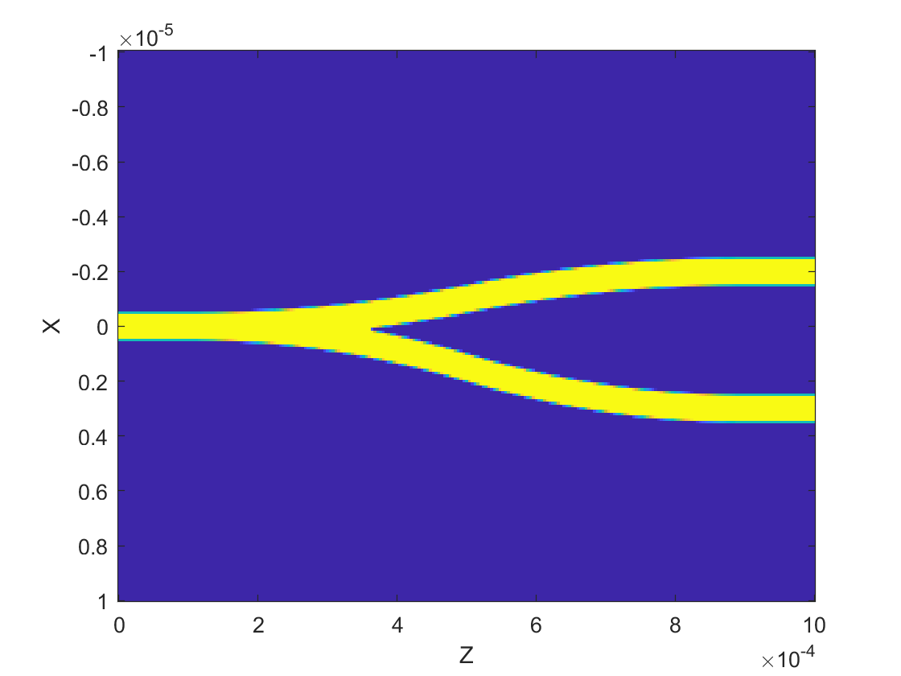

# bpm

## 背景

波束传播法（Beam Propagation Method，BPM）是一种用于模拟光在缓慢变化的光波导中传播的近似技术。以下是其相关介绍：
* 原理：BPM 基于缓变包络近似和单向波方程等理论基础。它将光场的传播问题转化为对缓变包络函数的求解，通过近似处理，将复杂的电磁场传播方程简化为可以数值求解的形式，从而能够追踪光在波导中传播时任意点的光场分布。
数值求解方法：在数值计算方面，有空间域方法和频域（谱域）方法。空间域方法通过求解线性方程来计算光场在下一传播步骤的情况；频域方法则利用快速傅里叶变换（FFT）等算法，具有稳定性好的优点，即使在存在非线性因素（如折射率或介质特性的非线性）时也能保持稳定，而空间域方法可能会出现数值不稳定的情况。
* 应用：BPM 是解决集成光学器件中光场问题的快速简便方法，主要用于计算光波导结构（如弯曲、锥形、终端等形状的波导）中的光强和模式，也可用于分析各向异性材料中光的偏振旋转、基于液晶的定向耦合器的可调性以及液晶显示器像素中的光衍射等，在集成光学和光纤光学领域有着广泛的应用。
* 局限性：BPM 依赖于缓变包络近似，对于离散或快速变化的结构、光以大角度传播的结构以及高折射率对比度的器件（如硅光子学中的常见器件）建模不准确。不过，一些先进的实现方法在一定程度上减轻了这些限制，使得 BPM 能够准确地模拟许多此类情况。

基于ARMADILLO的BPM波束传输法的C++实现，使用向量形式的
对角矩阵存储，降低了内存占用，同时计算系数矩阵采用并行计算，
提升了计算速度。在线性方程组求解中使用了三对角矩阵的迭代解法
，提升了计算速度。

## 使用

采用h5文件存储需要的数据，在mian.cpp中，展示出
h5文件里面的datasetname。
```
    field<string> rosft = {
    "x", "y", "z", 
	"Epsx", "Epsy", "Epsz","Epsxy","Epsyx",
    "Exin", "Eyin",
    "neff","lambda"
    };
```

## 原理


## 全矢量

### 模型



### 结果

#### TE Ex


#### TM Ey


### 广角全矢量

实现三维全矢量广角传播，推荐使用（1，1）
|Pade Order|
|---|
|1，0|
|1，1|
|2，2|
|3，3|
|4，4|
|5，5|

#### 广角模型
